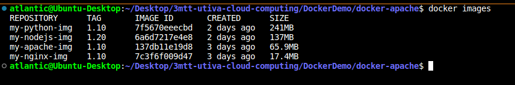
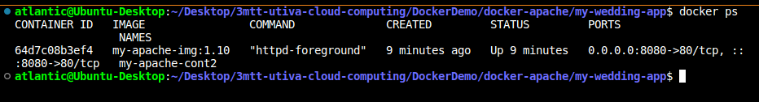

# How to Create an Apache (HTTP) Docker Image With a Dockerfile

1. Install apache 2 on your linux, ubuntu, cestos, etc. machine or server
2. Create a new project folder or directory and change into it.
3. Download any HTTP or static web template of your choice and place in the project directory
4. Create a Dockerfile in the project directory where the http web template files are located. If the web template files are download in a folder, your Dockerfile must be placed insde the folder. Below command can be used to create a Dockerfile

        $ sudo touch Dockerfile

5. Configure the Dockerfile as shown below using an httpd base image from the docker official website. In this exercise, an alpine base image was selected due to its small size.

        # Using an official Apache (httpd) as the base image 
        
        FROM httpd:alpine3.19

        # Copying the website template files (in current directory ".") to the container's document root
        
        COPY . /usr/local/apache2/htdocs/

        # Exposing port 80 for HTTP traffic
        
        EXPOSE 80

6. To build the apache2 docker image, use this commands

        $ docker build -t my-apache-img:1.20

7. To view or print on the screen the list of all docker images, use this command
        
        $ docker images

### Output       

7. To run the docker container for the apache2 image, use this command

$ sudo docker run -d --name my-apache-cont p 80:80 my-apache-img:1.10

8. To view the list of docker containers currently running, use this command

        $ sudo docker ps

### Output

### Viewing the apache website on firefox browser on ubuntu linux machine

9. To view the list of all docker images (running and stopped, use this command)

        $ sudo docker ps -a

10. To start [stop] a containers from running, use this command

        $ sudo docker start [stop] [container_ID or container_name]

11. To remove a docker image, use

        $ sudo docker rmi [image_name:tag]
        
12. To remove a docker container, use

        $ sudo docker rm [container_ID or container_name]

### END